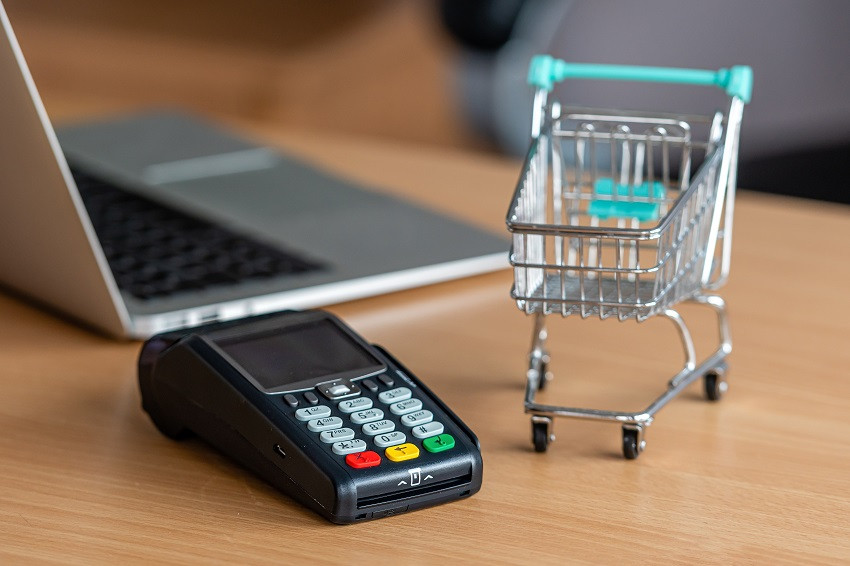

<p align='left'>
    
</p>

# Individual Project - eCommerceEdar

<p align="right">
  
</p>

## Objetivos del Proyecto

- Construir una App utlizando React, Redux, Node y Sequelize.
- Afirmar y conectar los conceptos aprendidos en la carrera.
- Aprender mejores prácticas.
- Aprender y practicar nuevos conceptos impresindibles para todas las funcionalidades de la e-commerce.

## Horarios y Fechas

El proyecto tendrá una duración máxima de cuatro semanas.

## BoilerPlate

El boilerplate cuenta con dos carpetas: `backend` y `client`. En estas carpetas estará el código del back-end y el front-end respectivamente.

Será necesario que creen desde psql una base de datos llamada `edarkostore`, un archivo .env dentro de backend y setearlo acorde a sus propios datos ej:

```
DB_USER=postgres
DB_PASSWORD=password
DB_HOST=localhost
```

El contenido de `client` fue creado usando: Create React App.

## Enunciado

La idea general es crear una aplicación en la cual se puedan ver los distintos productos disponibles junto con información relevante de los mismos

- Login
- Buscar productos
- Filtrarlos / Ordenarlos
- Comprar

### Requerimientos mínimos:

- https://docs.google.com/spreadsheets/d/1D3cA5SqImIlMaRrnLgyxzsDp9rVk323g/edit?usp=sharing&ouid=102824467810996812667&rtpof=true&sd=true

#### Tecnologías necesarias:

- [ ] React
- [ ] Redux
- [ ] Express
- [ ] Sequelize - Postgres

\*\*\*\*\*\*\*\*\*\*\*\*\*\*\*\*\*\*\*\*\*\*\*\*\*\*\*\*\*\*\*\*\*\*\* QUE EMPIECE EL JUEGO XD!!! \*\*\*\*\*\*\*\*\*\*\*\*\*\*\*\*\*\*\*\*\*\*\*\*\*\*\*\*\*\*\*\*\*\*\*

#### Base de datos

El modelo de la base de datos: https://lucid.app/lucidchart/9726f854-8120-440a-aace-08ed6276956f/edit?invitationId=inv_e4dab0c1-39f3-4fa6-b7de-0c1de33f4299

#### Backend

Se debe desarrollar un servidor en Node/Express con las siguientes rutas:

- [ ] **POST /product**:

  - Recibe los datos necesarios por body, valida la data
  - Crea un producto en la base de datos, recuerdar verificar el modelo E-R para ingresar correctamente un producto a la D.B.
    la data se debe repartir en los modelos: Product, Image, Category, Supplier.

- [ ] **GET /products**:

  - Obtener un listado de los products
  - Debe responder solo con los datos necesarios para una primera vista (name, imagen principal, precio,rating) y id.

- [ ] **GET /products?name="..."**:

  - Obtener un listado de los productos que contengan la palabra ingresada como query parameter
  - Si no existe ningún producto mostrar un mensaje adecuado. res.json({msg:'Not found'})

- [ ] **GET /products/{idProduct}**:

  - Obtener el detalle de un producto en particular (solo datos necesarios para la ruta detalle del front),
  - Incluir imagenes asociadas, en caso que tenga.

- [ ] **GET /categories**:

  - Obtener todas las categories posibles.

#### Frontend

Se debe desarrollar una aplicación de React/Redux que contenga las siguientes pantallas/rutas.

**Pagina inicial**: /

**Ruta para comprar productos**: /store
debería contener:

- [ ] form de búsqueda para encontrar productos por nombre
- [ ] Área donde se verá el listado de productos (paginado). Deberá mostrar su:
  - Nombre
  - Imagen principal
  - Precio
- [ ] Paginado; 10 productos por pagina. (desde el back ya debería tener una ruta que entrega la pagina que se le pida) ej: si dan click en algún botón que renderiza la pagina 2, pegarle al back y que entregue los productos de dicha pagina.
- [ ] Opciones para filtrar por categories (desde el backend se hará el filtrado, solo debería pegarle a la ruta encargada entregarle los datos ya filtrados)
- [ ] Opciones para ordenar tanto ascendentemente como descendentemente los productos por precio

**Ruta de detalle de producto**:

- pegarle al back para obtener el detalle de un producto en particular (fullData). y renderizarlo en una card especial, lo mas hermoso que se pueda.
- boton agregar al carrito
- boton agregar a favoritos
- boton comprar

**Ruta de creación de productos**: debe contener

- [ ] Un formulario **controlado** con los siguientes campos
  - Nombre
  - Descripción
  - Precio de venta
  - Stock
  - Imagen principal
  - Posibilidad de seleccionar/agregar varias imagenes secundarias
  - Posibilidad de seleccionar/agregar varias categorias
  - Botón/Opción para crear un nuevo producto
